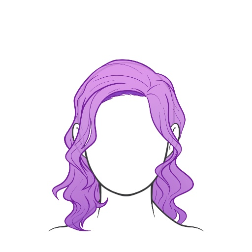

# Hairstyle Taxonomy

Our hairstyle taxonomy consists of 18 attributes.
There are ten global attributes which are based on the whole hairstyle, for example the shape of the hairline or surface appearance of the hair.
The scalp is divided into eight regions and each region is annotated with eight local attributes, such as length and strand styling.
So in total each hairstyle has 74 taxonomic labels.
While we hope that the taxonomy presented is sufficiently fair, objective and complete, we recognize that it is likely impossible for it to be truly complete.
We therefore encourage future work to extend the taxonomy as required and contribute any modifications back to this repository.
Below is a graphical representation of the taxonomy.

## Global Attributes

| Attribute | Values | | | | | | | | | | |
|-|-|-|-|-|-|-|-|-|-|-|-|
| Bangs Style | None  | Straight  | V-shape  | U-shape  | Inverted U  | Inverted V  | Diagonal R/L  | Diagonal L/R  |
| Bangs Length | Above  | To  | Below  |
| Accessories |
| Parting | Center  | Right  | Left  | Diagonal  | Zig-Zag  | Other  |
| Hairline Shape | Straight | Bell-Shaped | Receding | Widows-Peak | Uneven | Unkown |
| Hairline Position | High  | Medium  | Low  |
| Hairline Visibility | Full  | Partial Left  | Partial Right  | None  |
| Surface | Matte  | Shiny  | Very Shiny  | Wet  |
| Baby Hair | None  | Unstyled  | Styled  | Unkown  |
| Attribute Varies | No | Yes |

## Scalp Regions

| Front | Top | Crown | Nape | Right Side | Right Temple | Left Temple | Left Side |
|-|-|-|-|-|-|-|-|
|  |  |  |  |  |  |  |  |

## Local Attributes

